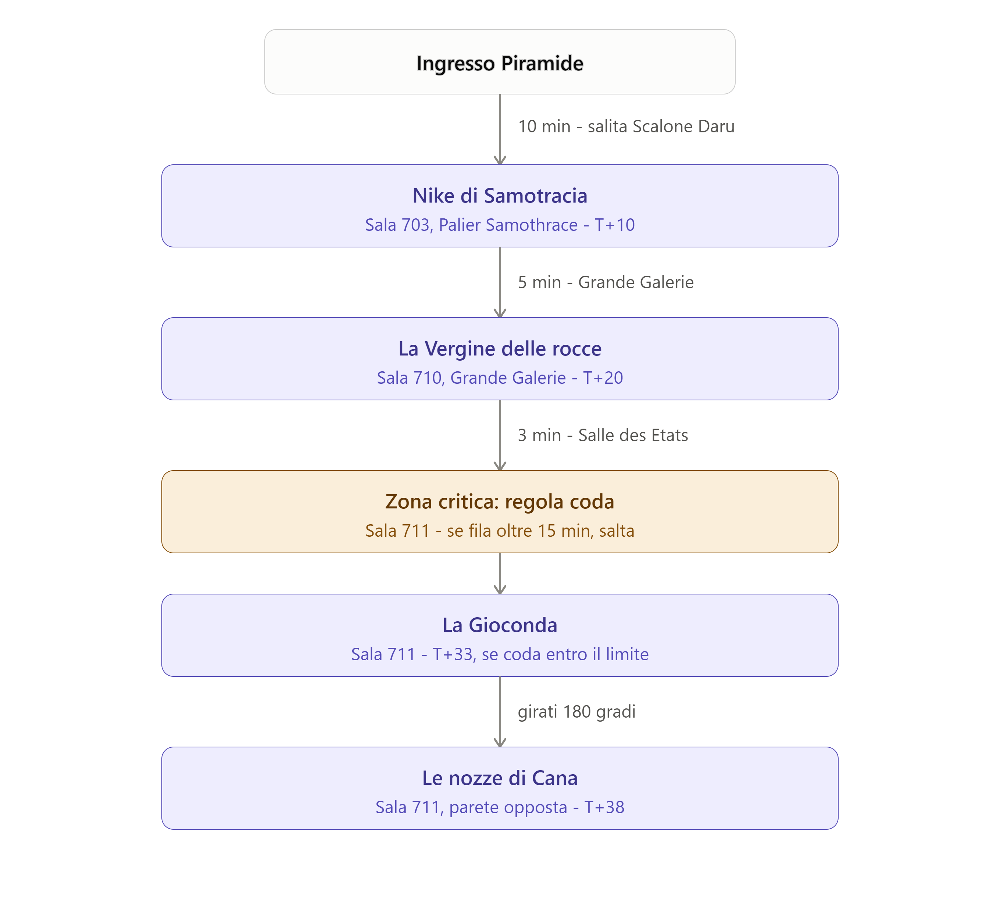
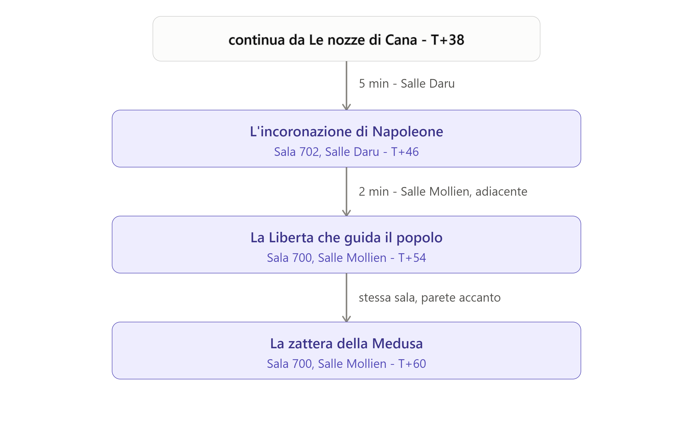
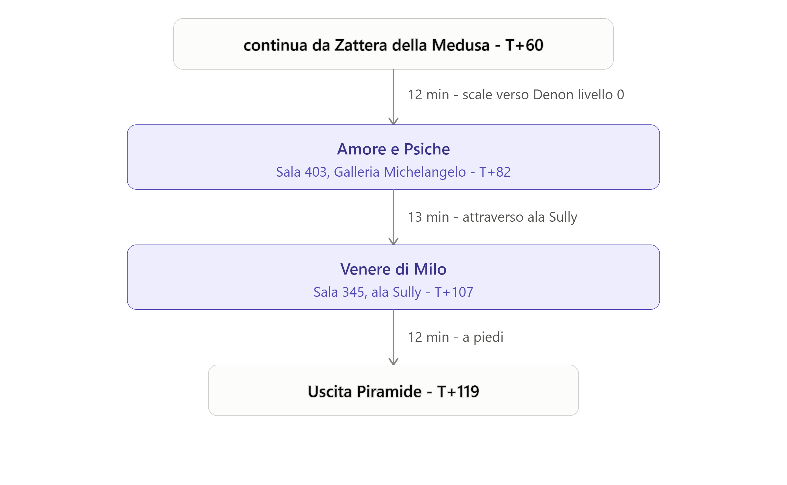
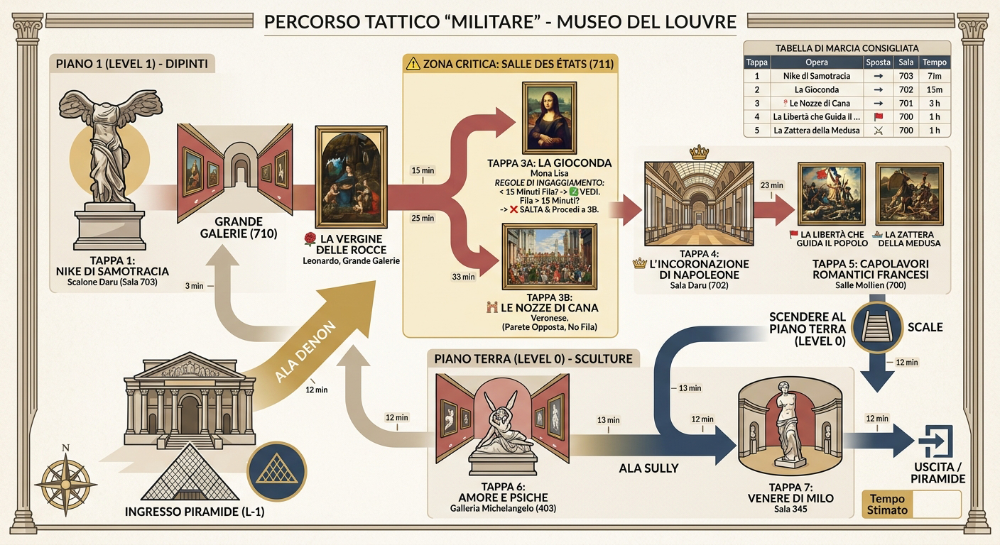

# 🎯 Itinerario Tattico - Museo del Louvre
⬅️ [Torna al programma](README.md)

**Tempo stimato:** 2 ore e 15 minuti - 2 ore e 45 minuti  
**Strategia:** Sequenza a flusso unico (Denon Piano 1 ➔ Denon Piano 0 ➔ Sully Piano 0) per eliminare i tempi morti e coprire tutti i capolavori richiesti.

---

## 🚀 Il Percorso Passaggio per Passaggio

### 1. Ingresso e Primo Capolavoro
* **Partenza:** Entrata dall'Ala Denon sotto la Piramide (Livello -1).
* **🗿 TAPPA 1: ⬅️ [Nike di Samotracia](nike-samotracia.md)**
  * **Ubicazione:** Scalone Daru (Livello 1, Sala 703).
  * **Percorso:** Entrati nell'Ala Denon, saliamo lo scalone monumentale Daru. La Nike domina la sommità della scalinata.
  * **  
---

### 2. Il Rinascimento Italiano (Livello 1 - Ala Denon)
Dalla Nike, entraiamo direttamente nella **Grande Galerie** (Sala 710).

* **🌹 TAPPA 2: ⬅️ [La Vergine delle rocce](vergine-rocce.md)**
  * **Ubicazione:** Grande Galerie (Sala 710).
  * **Percorso:** Camminiamo lungo il corridoio principale della Grande Galerie; la tela si trova esposta sulla parete prima dell'accesso alla Salle des États.

* **🖼️ TAPPA 3: ⬅️ [La Gioconda - Monna Lisa](gioconda.md) & 💒 ⬅️ [Le Nozze di Cana - Veronese](nozze-cana.md)**
  * **Ubicazione:** Salle des États (Sala 711).
  * **Percorso:** Svoltate a destra dalla Grande Galerie ed entrate nella Sala 711.
  * **⚠️ REGOLA DI INGAGGIAMIENTO:**  
    * Varcata la soglia, verifichiamo immediatamente la coda interna.  
    * **Se la fila per la Gioconda supera i 15 minuti:** *SALTIAMO LA GIOCONDA.*  
    * Ci giriamo subito di 180° e ammiriamo **Le Nozze di Cana** sulla parete opposta (opera monumentale visibile perfettamente e senza alcuna fila).

---

### 3. Il Romanticismo e Neoclassicismo Francese (Livello 1 - Ala Denon)
Uscite dalla Salle des États dalla parte opposta ed entrate nelle sale rosse della pittura francese.

* **👑 TAPPA 4: ⬅️ [L'Incoronazione di Napoleone - Jacques-Louis David ](incoronazione-napoleone.md)**
  * **Ubicazione:** Sala Daru (Sala 702).
  * **Percorso:** Adiacente alla Salle des États. Il quadro imponente domina la parete principale.

* **🚩 TAPPA 5: ⬅️ [La Libertà che guida il popolo - Eugène Delacroix](liberta-guida-popolo.md) & 🌊 ⬅️ [La Zattera della Medusa -Théodore Géricault](zattera-medusa.md)**
  * **Ubicazione:** Salle Mollien (Sala 700).
  * **Percorso:** Proseguiamo direttamente dalla Sala 702 alla Sala 700. Troveremo entrambe le gigantesche tele esposte nella medesima sala.

---

### 4. Galleria Michelangelo e Sculture Classiche (Piano Terra / Livello 0)
Dalla Sala 700 scendete le scale fino al **Piano Terra (Livello 0)** dell'Ala Denon.

* **💞 TAPPA 6: ⬅️ [Amore e Psiche - Antonio Canova](amore-psiche.md)**
  * **Ubicazione:** Galleria Michelangelo (Sala 403).
  * **Percorso:** Al Piano Terra dell'Ala Denon, entraiamo nella Galleria Michelangelo. La scultura si trova verso il centro della sala.

* **🗿 TAPPA 7: ⬅️ [Venere di Milo](venere-milo.md)**
  * **Ubicazione:** Ala Sully (Sala 345 - Salle de la Vénus de Milo).
  * **Percorso:** Dalla Galleria Michelangelo proseguiamo dritto mantenendo la direzione verso l'**Ala Sully**. Attraversiamo le sale dell'arte greca fino alla Sala 345, dove la statua è posizionata al centro.

*(Fine del percorso: dalla Sala 345 ci troviamo a brevissima distanza dall'uscita verso la Piramide o l'Atrio Sully).*
---

## 🗺️ Schema Visivo del Flusso

⬅️ [Torna al programma](README.md)
